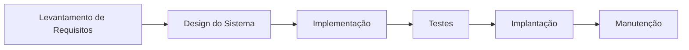
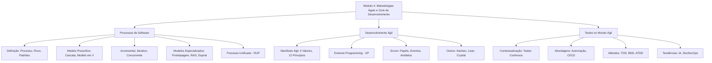

# Formação QA Experience

## 4 - Metodologias Ágeis e Ciclo de Desenvolvimento de Software

Este módulo explora os **processos de software**, com foco em **metodologias ágeis** e o papel do QA na garantia de qualidade em ciclos de desenvolvimento modernos. Ele aborda modelos tradicionais e ágeis, práticas de teste (TDD, BDD, ATDD) e a integração do QA em fluxos ágeis, com exemplos práticos e recursos para aprendizado contínuo.

---

## 4.1 - Processos de Software


---

### Introdução
Um **processo de software** é um conjunto estruturado de atividades que guiam o desenvolvimento de sistemas, desde a concepção até a manutenção. Ele promove **qualidade**, **previsibilidade** e **eficiência**, reduzindo riscos e facilitando a colaboração entre equipes.

* **Importância**:
  - Define padrões e fluxos claros para o desenvolvimento.
  - Minimiza riscos (ex.: falhas em produção).
  - Melhora a comunicação entre devs, QAs e stakeholders.

---

### Definindo Processo, Fluxo e Padrões de Software
- **Processo**: Conjunto de etapas e atividades (ex.: levantamento de requisitos, testes, implantação).  
- **Fluxo**: Sequência lógica das atividades.  
- **Padrões**: Boas práticas e convenções (ex.: código limpo, critérios de aceitação).  

**📌 Exemplo de Fluxo Genérico** (em Mermaid):  


**Papel do QA**: Validar requisitos, criar casos de teste e monitorar qualidade em cada etapa.

---

### Modelo Prescritivo
Modelos tradicionais, como **Cascata (Waterfall)** e **Modelo em V**, seguem um fluxo rígido e sequencial.  

**Características**:
- Fases bem definidas (ex.: análise → design → codificação → testes).  
- Documentação detalhada antes da implementação.  

**Vantagens**:
- Estrutura clara e previsível.  
- Ideal para projetos com requisitos estáveis (ex.: sistemas governamentais).  

**Desvantagens**:
- Pouca flexibilidade para mudanças.  
- Testes tardios aumentam o custo de correções.  

**📌 Exemplo Prático**:  
- **Cenário**: Sistema bancário com requisitos fixos.  
  - QA valida documentos de requisitos antes do desenvolvimento e executa testes funcionais no final.  

**📖 Estudo Complementar**:  
- [Waterfall Model – IBM](https://www.ibm.com/topics/waterfall-model)  
- [Modelo em V – ISTQB](https://www.istqb.org/)  

---

### Modelos Incremental, Iterativo e Concorrente
- **Incremental**: Entrega o sistema em partes funcionais (ex.: módulos entregues em sprints).  
- **Iterativo**: Refina o mesmo módulo em ciclos sucessivos (ex.: melhorar UI com base em feedback).  
- **Concorrente**: Permite que fases (ex.: design, testes) ocorram simultaneamente.  

**Papel do QA**:  
- Validar incrementos entregues (ex.: testes de regressão).  
- Colaborar em iterações para refinar requisitos.  
- Monitorar fluxos concorrentes para garantir integração.  

**📌 Exemplo Prático**:  
- **Cenário**: Desenvolvimento de um app de e-commerce.  
  - Incremento 1: Funcionalidade de login.  
  - Iteração: Melhorar UI do login com base em testes de usabilidade.  
  - Concorrência: QA testa login enquanto devs implementam carrinho.  

---

### Modelos Especializados
- **Prototipagem**: Cria protótipos rápidos para validar conceitos com usuários.  
- **RAD (Rapid Application Development)**: Prioriza entregas rápidas e feedback contínuo.  
- **Espiral**: Combina iterações com análise de riscos em cada ciclo.  

**Papel do QA**:  
- Testar protótipos para usabilidade e funcionalidade.  
- Validar entregas rápidas no RAD com testes exploratórios.  
- Avaliar riscos no modelo espiral (ex.: testes de segurança).  

**📖 Estudo Complementar**:  
- [RAD – Microsoft](https://learn.microsoft.com/en-us/previous-versions/windows/desktop/legacy/aa295769(v=vs.60))  
- [Spiral Model – GeeksforGeeks](https://www.geeksforgeeks.org/software-engineering-spiral-model/)  

---

### Processo Unificado (RUP)
O **Rational Unified Process (RUP)** organiza o desenvolvimento em quatro fases:  
1. **Concepção**: Definição da ideia e escopo.  
2. **Elaboração**: Modelagem e planejamento do sistema.  
3. **Construção**: Desenvolvimento e testes intensivos.  
4. **Transição**: Entrega e manutenção.  

**Papel do QA**:  
- Participar da elaboração para definir critérios de aceitação.  
- Executar testes funcionais e de integração na construção.  
- Validar entrega final na transição (ex.: testes de aceitação do usuário - UAT).  

**📌 Exemplo Prático**:  
- **Cenário**: Sistema de CRM.  
  - QA colabora na elaboração para criar casos de teste baseados em requisitos.  
  - Executa testes de integração na construção (ex.: integração com API de e-mails).  

---

## 🔹 Tópico 2 - Desenvolvimento Ágil

### O Manifesto Ágil
Criado em 2001, o [Manifesto Ágil](https://agilemanifesto.org/iso/ptbr/manifesto.html) define:  
**4 Valores**:  
1. **Indivíduos e interações** acima de processos e ferramentas.  
2. **Software em funcionamento** acima de documentação abrangente.  
3. **Colaboração com o cliente** acima de negociação de contratos.  
4. **Responder a mudanças** acima de seguir um plano.  

**12 Princípios** (exemplos):  
- Entrega contínua de software funcional.  
- Aceitar mudanças de requisitos, mesmo em fases avançadas.  
- Colaboração diária entre desenvolvedores e stakeholders.  

**Papel do QA**: Garantir que os valores ágeis sejam refletidos nos testes (ex.: priorizar validação de funcionalidades críticas).  

---

### Extreme Programming (XP)
Metodologia ágil focada em **qualidade** e **feedback rápido**.  

**Práticas Principais**:  
- **Programação em Par**: Dois devs trabalham juntos, reduzindo erros.  
- **Testes Unitários Automatizados**: Validação constante do código.  
- **Refatoração**: Melhorias contínuas no código sem alterar funcionalidade.  
- **Entregas Frequentes**: Pequenos incrementos entregues regularmente.  

**Papel do QA**: Criar e manter testes unitários, colaborar em refatoração e validar entregas frequentes.  

**📌 Exemplo de Teste Unitário em C# (xUnit)**:  
```csharp
using Xunit;

public class CalculadoraTests
{
    [Fact]
    public void Somar_DeveRetornarResultadoCorreto()
    {
        var calc = new Calculadora();
        var resultado = calc.Somar(2, 3);
        Assert.Equal(5, resultado);
    }
}

public class Calculadora
{
    public int Somar(int a, int b) => a + b;
}
```

**📖 Estudo Complementar**:  
- [Extreme Programming](http://www.extremeprogramming.org/)  

---

### Scrum
Framework ágil mais popular, estruturado em:  
- **Papéis**: Product Owner (define prioridades), Scrum Master (facilita o processo), Time de Desenvolvimento (inclui QAs).  
- **Eventos**: Sprint (1-4 semanas), Planning, Daily Scrum, Review, Retrospective.  
- **Artefatos**: Product Backlog (lista de requisitos), Sprint Backlog (tarefas do sprint), Incremento (produto entregue).  

**Papel do QA**:  
- Participar do Planning para definir critérios de aceitação.  
- Executar testes durante o sprint (manuais e automatizados).  
- Contribuir na Retrospective para melhorar processos de teste.  

**📌 Exemplo Prático**:  
- **Cenário**: Sprint de 2 semanas para desenvolver login.  
  - QA escreve casos de teste baseados em critérios de aceitação (ex.: “Usuário deve logar em < 2s”).  
  - Automatiza testes com Cypress e integra no pipeline CI/CD (ex.: GitHub Actions).  

---

### Outros Modelos Ágeis
- **Kanban**: Visualiza o fluxo de trabalho em quadros (ex.: Trello, Jira).  
- **Lean**: Elimina desperdícios, focando no valor ao cliente.  
- **Crystal**: Prioriza comunicação em equipes pequenas.  

**Papel do QA**:  
- No Kanban, monitorar o fluxo de tarefas de teste.  
- No Lean, otimizar testes para reduzir retrabalho.  
- No Crystal, colaborar intensamente com devs e stakeholders.  

**📖 Estudo Complementar**:  
- [Kanban – Atlassian](https://www.atlassian.com/agile/kanban)  
- [Lean Software Development](https://www.lean.org/)  

---

## 🔹 Tópico 3 - Testes no Mundo Ágil

### Contextualizando a Atividade de Teste
Nos métodos tradicionais, testes ocorrem no final do desenvolvimento, aumentando custos de correção. No ágil, testes são **contínuos**, integrados desde o planejamento até a produção (*shift-left* e *shift-right*).

**Papel do QA**:  
- Colaborar na definição de user stories com critérios de aceitação.  
- Automatizar testes para suportar CI/CD.  
- Monitorar qualidade em produção (ex.: logs com Grafana).  

---

### Testes nas Abordagens Ágeis
- **Contínuos**: Executados em cada sprint, integrados ao pipeline CI/CD.  
- **Automatizados**: Ferramentas como Selenium, Cypress e Playwright aceleram validação.  
- **Exploratórios**: Identificam defeitos não cobertos por automação.  
- **Não Funcionais**: Testes de performance, segurança e usabilidade.  

**Ferramentas Populares**:  
| **Categoria**            | **Ferramentas**                              | **Uso**                              |
|--------------------------|----------------------------------------------|--------------------------------------|
| Testes Web               | Selenium, Cypress, Playwright               | Automação de fluxos web              |
| Testes Unitários         | xUnit, JUnit, Jest                          | Validação de unidades de código       |
| CI/CD                    | Jenkins, GitHub Actions, Azure DevOps       | Integração de testes automatizados    |
| Monitoramento            | Prometheus, Grafana                         | Análise de logs em produção          |

---

### Métodos de Testes nos Modelos Ágeis
- **TDD (Test-Driven Development)**: Escreve testes antes do código, guiando a implementação.  
- **BDD (Behavior-Driven Development)**: Testes baseados em comportamentos esperados, usando linguagem natural (ex.: Gherkin).  
- **ATDD (Acceptance Test-Driven Development)**: Testes baseados em critérios de aceitação definidos com o cliente.  

**📌 Exemplo de TDD em C# (xUnit)**:  
```csharp
[Fact]
public void DeveCalcularFatorialDe5()
{
    var mat = new Matematica();
    var resultado = mat.Fatorial(5);
    Assert.Equal(120, resultado);
}

public class Matematica
{
    public int Fatorial(int n)
    {
        return n <= 1 ? 1 : n * Fatorial(n - 1);
    }
}
```

**📌 Exemplo de BDD em Gherkin (Cucumber)**:  
```gherkin
Feature: Login
  Scenario: Login com credenciais válidas
    Given que o usuário está na página de login
    When preenche email "usuario@teste.com" e senha "senha123"
    Then é redirecionado para o dashboard
```

**📌 Exemplo de ATDD**:  
- **Cenário**: Validação de checkout em e-commerce.  
  - Critério de aceitação: “O usuário deve finalizar a compra em < 5s e receber confirmação.”  
  - Teste automatizado com Playwright:  
    ```javascript
    const { test, expect } = require('@playwright/test');

    test('Checkout com sucesso', async ({ page }) => {
      await page.goto('/cart');
      await page.click('#checkout');
      await page.fill('#card', '1234567812345678');
      await page.click('#submit');
      await expect(page).toHaveURL(/success/);
    });
    ```

**Tendências em Testes Ágeis (2025)**:  
- **IA no QA**: Ferramentas como Testim e Mabl geram casos de teste automaticamente.  
- **Testes Autônomos**: Scripts que se adaptam a mudanças na UI.  
- **DevSecOps**: Integração de testes de segurança (ex.: OWASP ZAP) nos pipelines ágeis.  

**📖 Estudo Complementar**:  
- [Cucumber – BDD](https://cucumber.io/docs/bdd/)  
- [Testim – Automação com IA](https://www.testim.io/)  
- [OWASP ZAP – Segurança](https://www.zaproxy.org/)  

---

## 🔹 Tópico 4 - Conclusão
- Processos de software evoluíram de modelos rígidos (ex.: Cascata) para abordagens **ágeis e adaptáveis** (ex.: Scrum, Kanban).  
- O QA no mundo ágil é um **parceiro estratégico**, participando desde a concepção até a produção.  
- Testes contínuos, automatizados e baseados em TDD/BDD/ATDD garantem entregas rápidas e confiáveis.  
- Habilidades como **colaboração**, **mentalidade investigativa** e **aprendizado contínuo** são essenciais para o QA moderno.  

---

## 🔗 Links de Estudo
- [Manifesto Ágil](https://agilemanifesto.org/iso/ptbr/manifesto.html)  
- [Scrum Guide](https://scrumguides.org/)  
- [Microsoft Docs – Testes em .NET](https://learn.microsoft.com/pt-br/dotnet/core/testing/)  
- [Alura – Metodologias Ágeis](https://www.alura.com.br/artigos/metodologias-ageis)  
- [ThoughtWorks – Agile](https://www.thoughtworks.com/what-we-do/agile)  
- [Ministry of Testing – Comunidade QA](https://www.ministryoftesting.com/)  

---

## 🔹 Mapa Mental do Módulo


---

##### ✍️ Criado por: Fabio Zanneti - 🎯 Formação Quality Assurance (QA) Experience
[](https://github.com/fzanneti)
[](https://linkedin.com/in/fzanneti)
