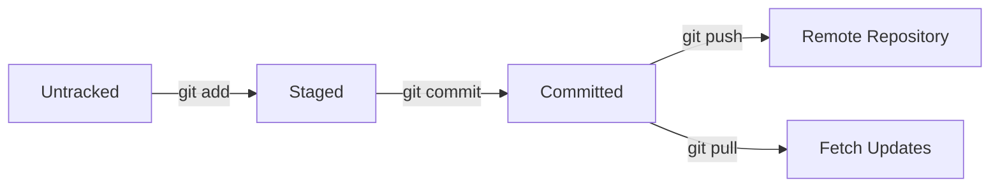

# Formação QA Experience

## 6 - Introdução ao Git e ao GitHub


Este módulo apresenta o **Git**, um sistema de controle de versão distribuído, e o **GitHub**, a principal plataforma de hospedagem de código, com foco no papel do QA. Ele cobre desde a instalação até a resolução de conflitos, com exemplos práticos, ferramentas modernas e práticas de 2025, como integração com CI/CD e automação com IA.

---

## 6.1 - Introdução ao Git

### O que é Git?

O **Git** é um sistema de **controle de versão distribuído** criado por **Linus Torvalds** em 2005 para gerenciar mudanças no código de forma eficiente e colaborativa.

**Por que usar Git?**

- Mantém um **histórico completo** de alterações.  
- Permite **trabalho em equipe** com segurança (ex.: múltiplos QAs em um projeto).  
- Suporta **branches** para desenvolvimento paralelo.  
- Facilita **reversão** a versões anteriores em caso de bugs.  

--- 

### Estudo Complementar:

🔗[Documentação Oficial Git](https://git-scm.com/doc)  
🔗[Pro Git (Livro Gratuito)](https://git-scm.com/book/pt-br/v2)  

---

## 6.2 - Navegação via Command Line Interface e Instalação

### Comandos Básicos de Terminal

O Git é frequentemente usado via terminal, exigindo familiaridade com comandos básicos.

```bash

# Navegar entre diretórios
cd nome_da_pasta

# Listar arquivos
ls    # Linux/Mac
dir   # Windows

# Criar pastas e arquivos
mkdir nova_pasta
touch arquivo.txt    # Linux/Mac
echo. > arquivo.txt  # Windows

# Ver caminho atual
pwd

# Remover arquivo/pasta
rm arquivo.txt
rm -rf pasta

```

---

### Instalando Git

- **Windows**: Baixe do [site oficial](https://git-scm.com/download/win) e instale com **Git Bash** (recomendado para simular ambiente Linux).  

- **Linux**:  

  ```bash

  sudo apt update
  sudo apt install git -y

  ```

- **Mac**:  

  ```bash

  brew install git

  ```

### Verificar instalação:

```bash

git --version
# Exemplo de saída: git version 2.46.0

```

### Tendência 2025: 

Ferramentas como **GitKraken** e **VS Code GitLens** integram Git com interfaces gráficas, facilitando o uso por QAs menos experientes com CLI.

---

### Estudo Complementar:

🔗[GitKraken - Interface Gráfica](https://www.gitkraken.com/)  
🔗[GitLens - VS Code](https://www.gitlens.amod.io/)  

---

## 6.3 - Entendendo Como o Git Funciona por Baixo dos Panos

### Tópicos Fundamentais

O Git gerencia **snapshots** (fotografias do projeto) em vez de apenas salvar arquivos. Cada commit representa um estado completo do projeto.

---

### 📂 Estrutura Interna:

- **Working Directory**: Arquivos locais editáveis.  
- **Staging Area**: Área de preparação para o próximo commit (`git add`).  
- **Repository**: Histórico versionado armazenado localmente (.git).  

---

### Objetos Internos do Git

- **Blob**: Conteúdo de um arquivo.  
- **Tree**: Estrutura de diretórios e arquivos.  
- **Commit**: Snapshot com metadados (autor, data, mensagem).  
- **Tag**: Marca pontos específicos (ex.: versão 1.0).  

---

### Chave SSH e Token

- **Chave SSH**: Autenticação segura para repositórios remotos.  

  ```bash

  ssh-keygen -t ed25519 -C "seuemail@exemplo.com"
  # Para sistemas mais antigos:
  ssh-keygen -t rsa -b 4096 -C "seuemail@exemplo.com"

  ```
Adicione a chave pública em *GitHub > Settings > SSH and GPG keys*.  

- **Personal Access Token (PAT)**: Alternativa à senha, usada para autenticação via HTTPS. Criado em *GitHub > Settings > Developer settings > Personal access tokens*.  

---

### Estudo Complementar: 

🔗[Gerando Chave SSH - GitHub](https://docs.github.com/pt/authentication/connecting-to-github-with-ssh)  
🔗[Personal Access Tokens - GitHub](https://docs.github.com/pt/authentication/keeping-your-account-and-data-secure/creating-a-personal-access-token)  

---

## 6.4 - Primeiros Comandos do Git

```bash

# Configuração inicial
git config --global user.name "Seu Nome"
git config --global user.email "seuemail@exemplo.com"

# Criar um repositório
git init

# Adicionar arquivos ao staging
git add arquivo.txt
git add .   # Adiciona todos os arquivos

# Criar commit
git commit -m "Adiciona script de teste inicial"

# Criar conexão com repositório remoto
git remote add origin git@github.com:usuario/repositorio.git

# Enviar alterações
git push -u origin main

```

---

### Estudo Complementar:

🔗[Git Cheat Sheet](https://education.github.com/git-cheat-sheet-education.pdf)  

---

## 6.5 - Ciclo de Vida dos Arquivos no Git

### Estados dos Arquivos:  

1. **Untracked**: Novo, não rastreado pelo Git.  
2. **Staged**: Preparado para commit (`git add`).  
3. **Committed**: Salvo no repositório local (`git commit`).  
4. **Pushed**: Enviado ao repositório remoto (`git push`).  

### Fluxo do Ciclo de Vida:  



---

## 6.6 - Introdução ao GitHub

O **GitHub** é a plataforma líder para hospedagem de código, integrando Git com funcionalidades colaborativas.

### Funcionalidades Principais:

- **Pull Requests (PRs)**: Revisão e aprovação de mudanças.  
- **Issues**: Gerenciamento de bugs e tarefas.  
- **GitHub Actions**: Automação de CI/CD.  
- **Wiki e Projects**: Documentação e organização de projetos.  

---

### Estudo Complementar:

- [Guia GitHub](https://docs.github.com/pt)  
- [GitHub Actions](https://docs.github.com/pt/actions)  
- [GitHub Copilot](https://github.com/features/copilot)  

---

## 6.7 - Resolvendo Conflitos

Conflitos ocorrem quando **duas alterações colidem** (ex.: mesma linha editada em branches diferentes).

### Passos para Resolver:  
1. Editar o arquivo manualmente, escolhendo ou combinando as versões.  
2. Adicionar ao staging:  
   ```bash

   git add arquivo.js
   
   ```
3. Criar commit:  
   ```bash

   git commit -m "Resolve conflito no teste"
   
   ```

---

### Estudo Complementar: 

🔗[Resolvendo Conflitos - GitHub](https://docs.github.com/pt/pull-requests/collaborating-with-pull-requests/addressing-merge-conflicts)  
🔗[Playwright - Documentação](https://playwright.dev/)  
🔗[Snyk - Segurança](https://snyk.io/)  
🔗[GitHub Codespaces](https://docs.github.com/pt/codespaces)  

---

## 6.8 - Conclusão

- O **Git** é essencial para QAs, permitindo versionamento de scripts de teste e colaboração em equipe.  
- O **GitHub** potencializa o Git com PRs, Issues e Actions, integrando testes ao fluxo CI/CD.  
- Em 2025, QAs devem dominar Git, pipelines automatizados e ferramentas como GitHub Copilot para se destacar.  
- Habilidades como **comunicação** (ex.: descrever PRs) e **mentalidade investigativa** (ex.: resolver conflitos) são cruciais.  

---

##### ✍️ Criado por: Fabio Zanneti - 🎯 Formação Quality Assurance (QA) Experience
[](https://github.com/fzanneti)
[](https://linkedin.com/in/fzanneti)